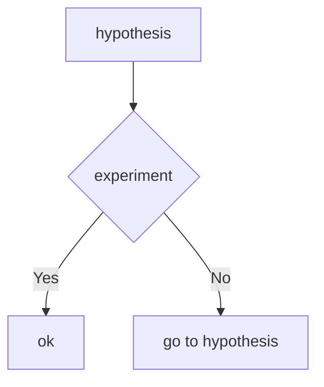

# 과학적분석및발표
---

## 1차 숙제
서울의 연평균 기온 분석

최저 기온 최고 기온

미래 예측


```mermaid
  flowchart TD;
    A[hypothesis] --> B{experiment};
    B -- Yes --> C[ok];
    B -- No --> D[go to hypothesis];
```

```python
  print("HelloWorld!")
```
